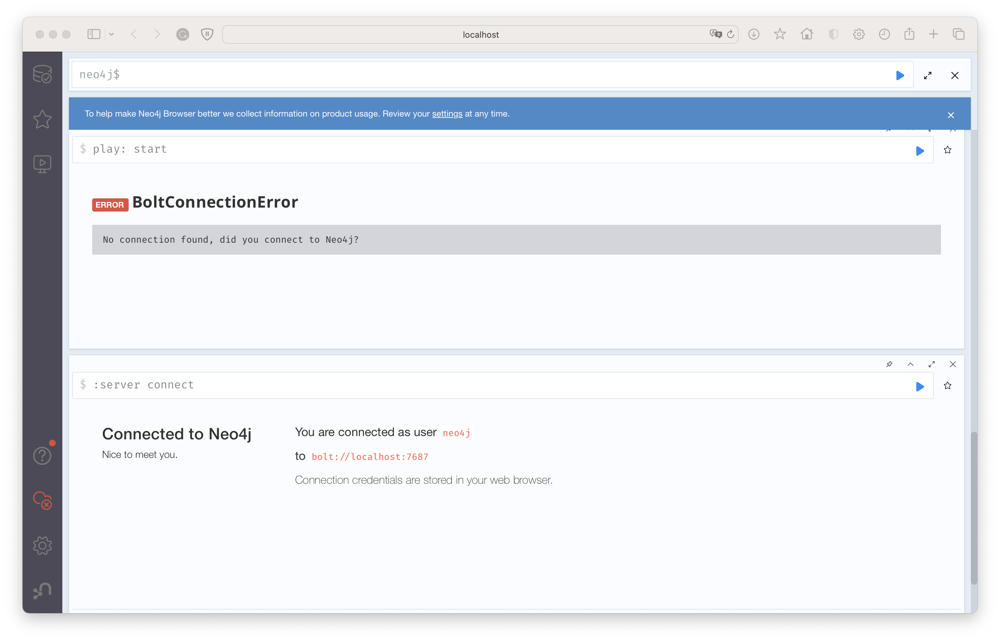
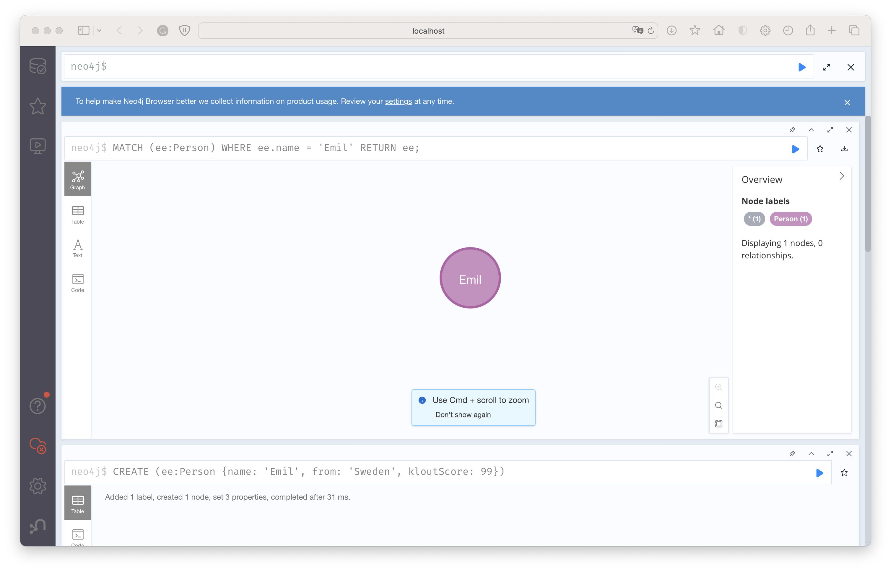
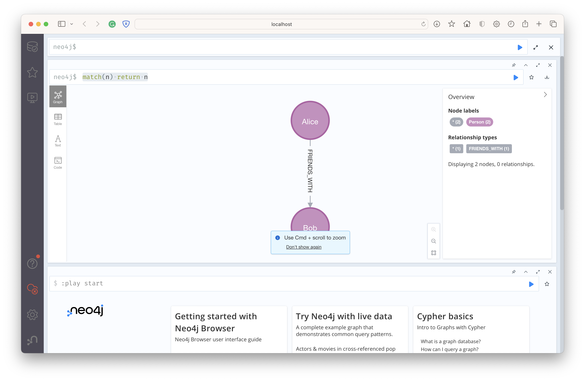

## Neo4j Docker

Running Neo4j in a Docker container provides isolation and flexibility, making it a popular choice for development and testing environments.

### Step 1: Install Docker

If you don't have Docker installed, you'll need to install it first. You can download Docker for Mac from the official Docker website.

### Step 2: Pull the Neo4j Docker Image

Open a terminal window and run the following command to pull the official Neo4j Docker image:

```bash
docker pull neo4j
```

### Step 3: Create a Neo4j Container

Next, create a container using the Neo4j image. You'll want to set up a password and expose the necessary ports. Run the following command, replacing "your_password" with a password of your choice:

```bash
docker run \
    --name my-neo4j \
    -p 7474:7474 \
    -p 7687:7687 \
    -e NEO4J_AUTH=neo4j/your_password \
    -d \
    neo4j
```

### Step 4: Access Neo4j Browser

Once the container is running, you can access the Neo4j Browser by navigating to http://localhost:7474 in your web browser. Log in with the username "neo4j" and the password you set earlier.

### Step 5: Connect from Python

You can now connect to this Neo4j instance from your Python code using the py2neo library, with the connection details:

```bash
uri = "bolt://localhost:7687"
username = "neo4j"
password = "your_password"
```



Now you can start running Cypher queries in the browser!



Run `python3 neo4j_example.py` to see how to connect to the database from Python, and run a simple query. You can go to the Neo4j browser to see the results of the query.

```bash
match(n) return n
```



## Managing the Container

Here are some common commands to manage the container:

Stop the Container: `docker stop my-neo4j`
Start the Container: `docker start my-neo4j`
Remove the Container: `docker rm my-neo4j`
These commands allow you to start, stop, and remove the Neo4j container as needed.

## Troubleshooting

### Check Docker Container Logs

Inspect the logs of the running container to see if there are any error messages or information related to the issue:

```bash
docker logs my-neo4j
```

This command will print the logs for the container named my-neo4j and may provide insights into what's going wrong.

### Ensure Correct Port Mapping

Verify that the ports are correctly mapped and that Neo4j is running on the specified ports. You used the correct port mapping in the docker run command, so this shouldn't be the issue, but it's worth confirming.

### Restart the Container

Restarting the container can resolve connection issues. You can stop and start the container with the following commands:

```bash
docker stop my-neo4j
docker start my-neo4j
```

Go back to Step 3 and try creating a new container if the issue persists.

### Remove the Container and Start Over

If all else fails, you can remove the container and start over. You can remove the container with the following command:

```bash
docker rm my-neo4j
```

Then, go back to Step 3 and try creating a new container. This will remove any data stored in the container, so you'll need to re-create any data you had in the database. You can see the unrunning containers with the following command:

```bash
docker ps -a
```
